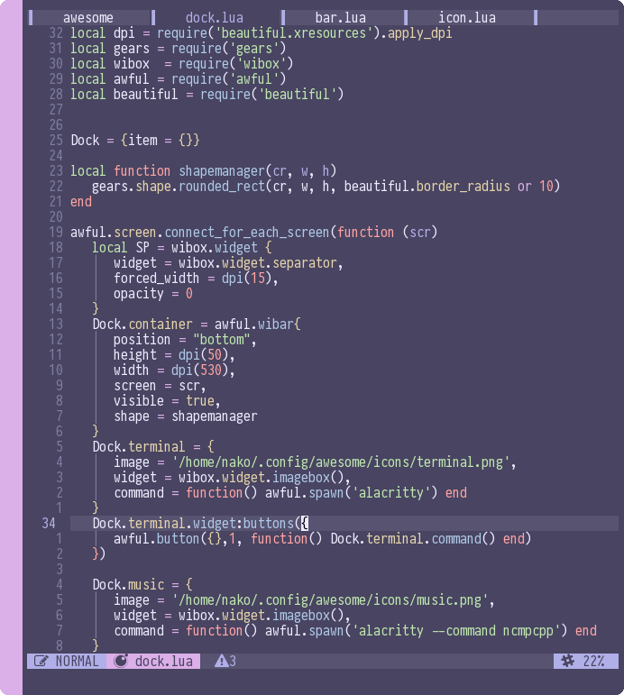

# Xresources-nvim
Neovim colorscheme based on your xresources color

### Require
- Neovim 0.5
- xrdb

### Install
**Vim Plug**
```vim
Plug 'nekonako/xresources-nvim'
```

### Usage

- lua
`lua require('xresources')`

- vimscript
`colorscheme xresources`

### Notes
if you use light colorscheme, set neovim background to light.

- lua
`lua vim.o.background = 'light'`

- vimscript
`set background=light`

### Preview

<center>



</center>

### Properties

| **Properties** | **Xresources**           |
| :----------: | :--------------------: |
| fg           | foreground             |
| bg           | background             |
| black        | color0                 |
| red          | color1                 |
| green        | color2                 |
| yellow       | color3                 |
| blue         | color4                 |
| purple       | color5                 |
| cyan         | color6                 |
| white        | color7                 |
| light_black  | color8                 |
| light_red    | color9                 |
| light_green  | color10                |
| light_yellow | color11                |
| light_blue   | color12                |
| light_purple | color13                |
| light_cyan   | color14                |
| light_white  | color15                |
| grey         | background + 0xf0f10   |
| grey1        | background + 0x363940  |
| none         | NONE                   |

### Example using properties

Let say i want using xresources to my [galaxyline](https://github.com/glepnir/galaxyline.nvim) 
configuration 
```lua
local galaxyline = require('galaxyline')
local color = require('xresources')
local section = galaxyline.section

section.left[1] = {
   FileName = {
      provider = get_current_file_name,
      condition = buffer_not_empty,
      -- acessing properties --
      highlight = {color.bg, color.purple},
      separator = " ",
      -- acessing properties --
      separator_highlight = {color.gray, color.gray}
   }
}
```

### Tips
- use [nvim-treesitter](https://github.com/nvim-treesitter/nvim-treesitter) for better highlight

### Similiar project
- [wal.vim](https://github.com/dylanaraps/wal.vim)

### Thanks
- [Glepnir](https://github.com/glepnir) - For colorscheme boilerplate
- [Elianiva](https://github.com/elianiva)
- [Dotfiles indonesia](https://t.me/dotfiles_id)
- [Vim indonesia](https://t.me/VimID)


