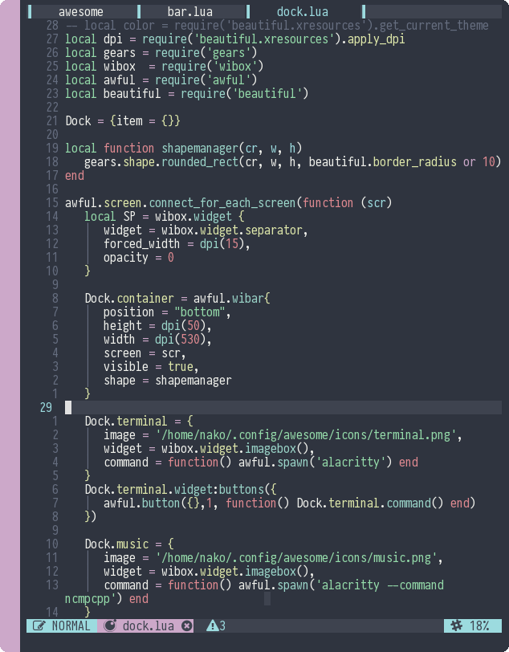
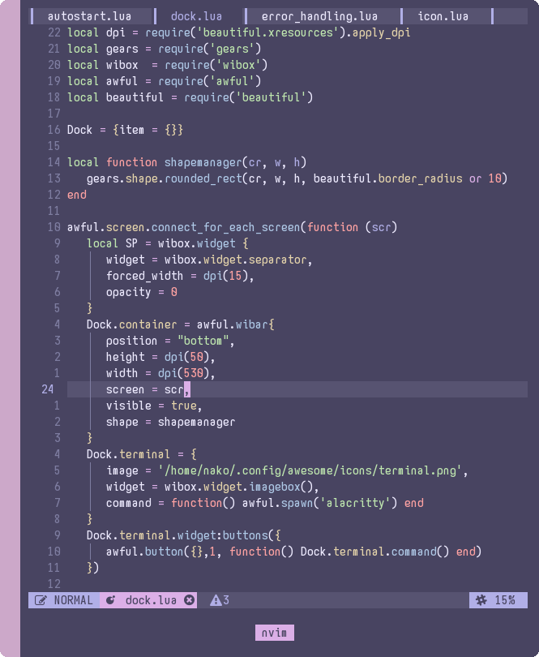

# Xresources-nvim
Neovim colorscheme based on your xresources color

### Require
- Neovim 0.5
- xrdb

### Install
***Vim plug***
```
Plug 'nekonako/xresorces-nvim'
```

### Usage
`lua require('xresources')`
or
`colorscheme xresorces`

### Preview



### Useful function
   ```lua
local color = require('xresources').get_color()
   -- properties
   -- red
   -- green
   -- yellow
   -- blue
   -- purple
   -- cyam
   -- grey


   -- example
local grey_color = color.grey
   ```

### Thanks
- [Glepnir](https://github.com/glepnir)
- [Elianiva](https://github.com/elianiva)
- [Fikri Omar](https://github.com/fikriomar16)
- [Dotfiles indonesia](https://t.me/dotfiles_id)
- [Vim indonesia](https://t.me/VimID)


